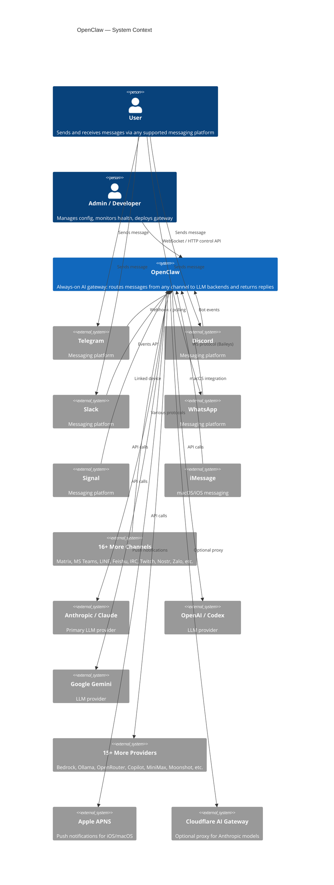
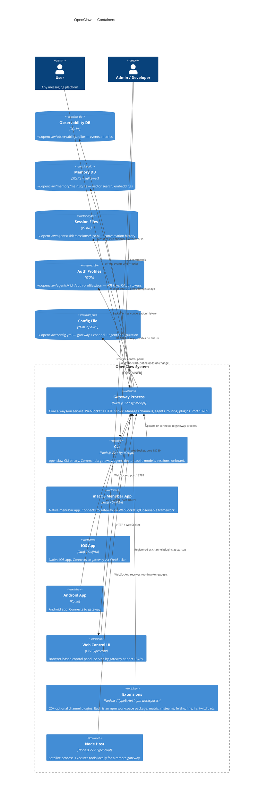
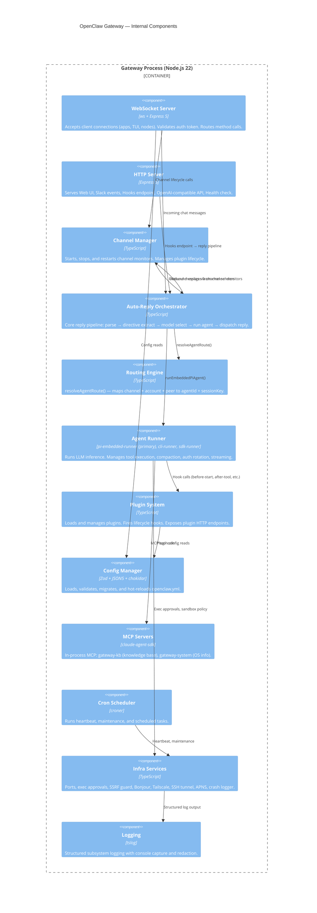
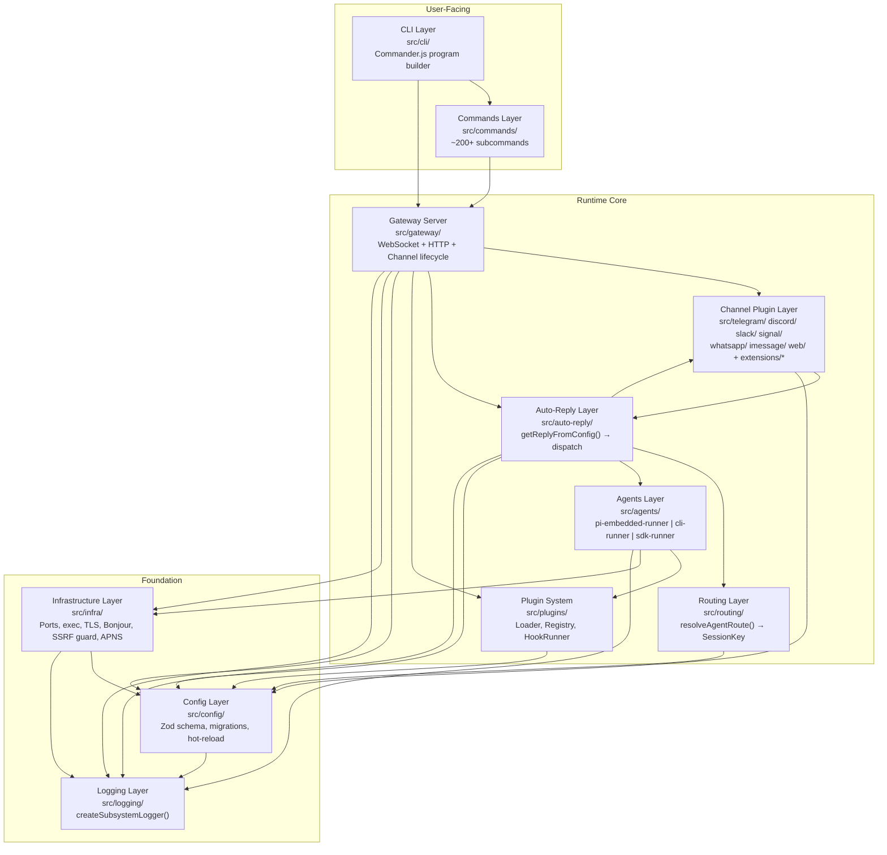
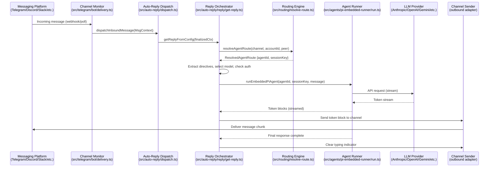
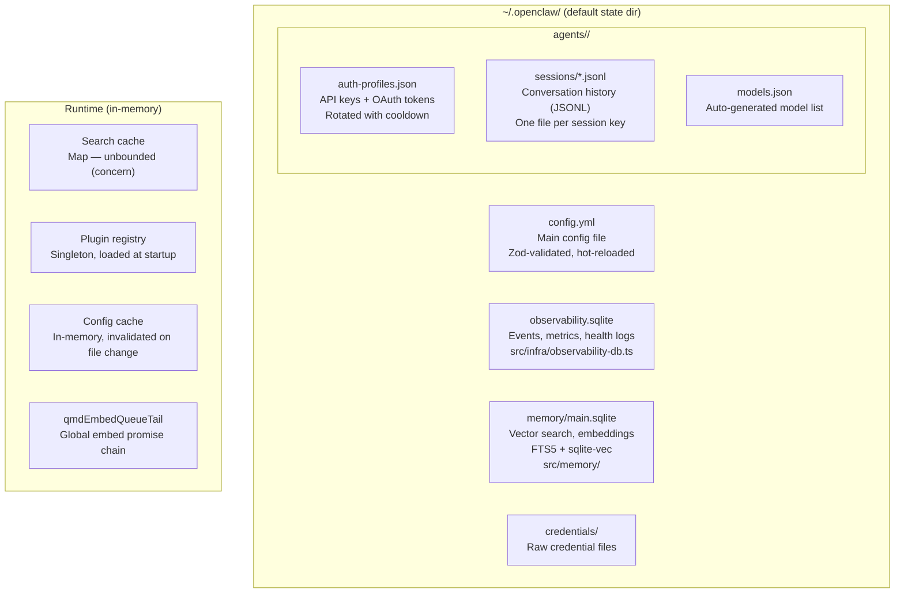
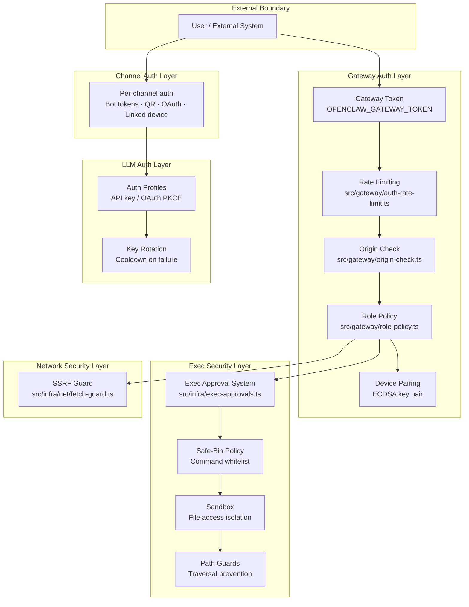
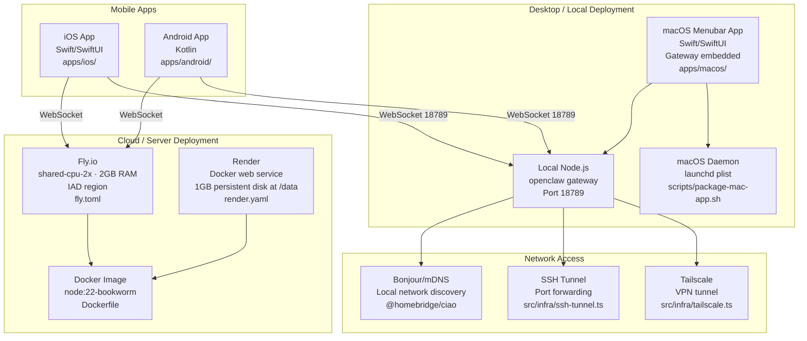

# Enterprise Architecture — OpenClaw

**System:** OpenClaw — Multi-channel AI gateway bridging messaging platforms to LLM backends
**Analysis Date:** 2026-03-01
**Source:** Codebase analysis via parallel mapper agents (`.planning/codebase/`)

---

## Table of Contents

1. [View 1 — C4 Model](#view-1--c4-model)
   - [L1: System Context](#l1-system-context)
   - [L2: Containers](#l2-containers)
   - [L3: Components (Gateway)](#l3-components-gateway)
2. [View 2 — Layer Stack](#view-2--layer-stack)
   - [Layer Diagram](#layer-diagram)
   - [Layer Reference](#layer-reference)
   - [Inbound Message Data Flow](#inbound-message-data-flow)
3. [View 3 — Domain Capability Map](#view-3--domain-capability-map)
   - [Capability Domains](#capability-domains)
   - [Integration Surface](#integration-surface)
4. [Cross-Cutting Views](#cross-cutting-views)
   - [Storage Map](#storage-map)
   - [Security Model](#security-model)
   - [Deployment Topology](#deployment-topology)
   - [Known Concerns Summary](#known-concerns-summary)

---

## View 1 — C4 Model

The C4 model zooms into the system across four levels. Level 1 shows OpenClaw in its world. Level 2 breaks down the major deployable containers. Level 3 shows the internal components of the core Gateway container.

---

### L1: System Context

> Who uses OpenClaw, and what external systems does it talk to?

---

### L2: Containers

> What are the major deployable/runnable units?

---

### L3: Components (Gateway)

> What are the internal components of the Gateway process?

---

## View 2 — Layer Stack

The code is organized as a strict dependency hierarchy. Upper layers depend on lower layers; lower layers never import from upper layers.

---

### Layer Diagram

---

### Layer Reference

| Layer           | Directory                                                           | Purpose                                                     | Key Files                                                                          | Key Abstractions                                    |
| --------------- | ------------------------------------------------------------------- | ----------------------------------------------------------- | ---------------------------------------------------------------------------------- | --------------------------------------------------- |
| CLI             | `src/cli/`                                                          | Parse argv, dispatch to gateway or local commands           | `src/cli/program/build-program.ts`                                                 | Commander.js program                                |
| Commands        | `src/commands/`                                                     | 200+ CLI subcommand implementations                         | `src/commands/agent/`, `src/commands/doctor-config-flow.ts`                        | Command handlers                                    |
| Gateway Server  | `src/gateway/`                                                      | Core always-on process; WebSocket + HTTP; channel lifecycle | `src/gateway/server.impl.ts`, `src/gateway/server-methods/`                        | `GatewayServer`, `startGatewayServer()`             |
| Channel Plugins | `src/telegram/`, `src/discord/`, `src/slack/`, etc. + `extensions/` | Adapters between messaging platforms and internal bus       | `src/telegram/bot/delivery.ts`, `src/discord/monitor/`                             | `ChannelPlugin`                                     |
| Routing         | `src/routing/`                                                      | Map channel + account + peer → agent + session key          | `src/routing/resolve-route.ts`, `src/routing/session-key.ts`                       | `resolveAgentRoute()`, `SessionKey`                 |
| Auto-Reply      | `src/auto-reply/`                                                   | Full inbound → LLM → outbound orchestration                 | `src/auto-reply/reply/get-reply.ts`, `src/auto-reply/dispatch.ts`                  | `getReplyFromConfig()`, `MsgContext`                |
| Agents          | `src/agents/`                                                       | LLM inference, tool execution, session management           | `src/agents/pi-embedded-runner/run.ts`, `src/agents/tools/`                        | `runEmbeddedPiAgent()`, `ResolvedAgentRoute`        |
| Plugin System   | `src/plugins/`                                                      | Plugin loading, registry, hook execution                    | `src/plugins/loader.ts`, `src/plugins/hook-runner-global.ts`                       | `PluginHookRunner`                                  |
| Infrastructure  | `src/infra/`                                                        | Platform utilities — no business logic                      | `src/infra/exec-approvals.ts`, `src/infra/home-dir.ts`, `src/infra/fetch-guard.ts` | `resolveEffectiveHomeDir()`, `fetchWithSsrFGuard()` |
| Config          | `src/config/`                                                       | Load, validate, migrate, cache config                       | `src/config/config.ts`, `src/config/zod-schema.ts`                                 | `OpenClawConfig`, `loadConfig()`                    |
| Logging         | `src/logging/`                                                      | Structured subsystem logging                                | `src/logging/subsystem.ts`                                                         | `createSubsystemLogger()`                           |

---

### Inbound Message Data Flow

---

## View 3 — Domain Capability Map

Organizes the system by _what it does_ rather than how the code is structured.

---

### Capability Domains

```mermaid
graph LR
  subgraph MSG["Messaging Domain"]
    M1["Built-in Channels\nTelegram · Discord · Slack\nWhatsApp · Signal · iMessage\nWeb · LINE"]
    M2["Extension Channels\nMatrix · MS Teams · Feishu\nGoogle Chat · IRC · Twitch\nNostr · Zalo · Mattermost\nNextcloud · Synology · Tlon"]
    M3["Channel Plugin Registry\nsrc/channels/plugins/"]
    M4["Routing Engine\nsrc/routing/"]
  end

  subgraph AI["AI/LLM Domain"]
    A1["Agent Runners\npi-embedded (primary)\ncli-runner · sdk-runner"]
    A2["LLM Providers\n18+ providers"]
    A3["Auth Profiles\nAPI key rotation\nOAuth PKCE"]
    A4["Tool Definitions\nbash · web-fetch · web-search\nmessage · sessions · discord · slack"]
    A5["Model Catalog\nmodel routing\nprovider discovery"]
  end

  subgraph MEM["Memory Domain"]
    ME1["Vector Search\nsqlite-vec extension"]
    ME2["Embedding Providers\nGemini · OpenAI · Mistral\nVoyage · node-llama-cpp (local)"]
    ME3["QMD Manager\nSession file scanning\nFTS5 + BM25 search"]
    ME4["Memory DB\n~/.openclaw/memory/main.sqlite"]
  end

  subgraph SEC["Security Domain"]
    S1["Exec Approval System\nsrc/infra/exec-approvals.ts"]
    S2["Safe-Bin Policy\nsrc/infra/exec-safe-bin-policy.ts"]
    S3["SSRF Guard\nsrc/infra/net/fetch-guard.ts"]
    S4["Sandbox\nsrc/agents/sandbox.ts"]
    S5["Path Guards\nsrc/infra/path-safety.ts"]
    S6["Gateway Auth\nToken · Rate limit · Origin check\nRole policy · Device pairing"]
  end

  subgraph CFG["Config & State Domain"]
    C1["Config File\n~/.openclaw/config.yml\nZod validated · Hot-reloaded"]
    C2["Session Store\nJSONL files per agentId"]
    C3["Auth Profiles\nJSON per agentId"]
    C4["Observability DB\nobservability.sqlite"]
    C5["Legacy Migrations\nconfig/legacy.migrations.*"]
  end

  subgraph OPS["Deployment & Ops Domain"]
    O1["Gateway Process\nNode.js 22 · Port 18789/18790"]
    O2["Docker\nnode:22-bookworm\nFly.io · Render"]
    O3["macOS App\nSwift/SwiftUI · Menubar"]
    O4["iOS App\nSwift/SwiftUI"]
    O5["Android App\nKotlin"]
    O6["CI/CD\nGitHub Actions\nLinux · macOS · Windows"]
    O7["Plugin System\nnpm packages loaded at runtime"]
  end

  MSG --> AI
  AI --> MEM
  AI --> SEC
  MSG --> CFG
  AI --> CFG
  MEM --> CFG
  OPS --> CFG
```

---

### Integration Surface

#### AI Model Providers

| Provider              | Type             | Auth                          | Notes                                          |
| --------------------- | ---------------- | ----------------------------- | ---------------------------------------------- |
| Anthropic (Claude)    | Primary LLM      | API key / OAuth / web session | opus-4-6, sonnet-4-6, haiku-4-5                |
| OpenAI / Codex        | LLM + Embeddings | API key                       | Codex uses Responses API, not Chat Completions |
| Google Gemini         | LLM + Embeddings | API key / OAuth JSON          | Used for fast/cheap tier                       |
| AWS Bedrock           | LLM              | AWS SDK env vars              | `amazon-bedrock` provider ID                   |
| GitHub Copilot        | LLM              | VS Code token auto-detected   | Injected when token found                      |
| Cloudflare AI Gateway | LLM proxy        | accountId + gatewayId         | Proxies Anthropic models                       |
| OpenRouter            | LLM aggregator   | API key                       | `auto` default model                           |
| Ollama                | Local LLM        | None (localhost:11434)        | Model discovery via local API                  |
| vLLM                  | Local LLM        | None (localhost:8000)         | OpenAI-compatible                              |
| HuggingFace           | LLM              | API key                       | router.huggingface.co                          |
| Together AI           | LLM              | API key                       | api.together.xyz                               |
| Venice AI             | LLM              | API key                       | api.venice.ai                                  |
| NVIDIA                | LLM              | API key                       | integrate.api.nvidia.com                       |
| MiniMax               | LLM              | OAuth PKCE                    | api.minimax.io/anthropic                       |
| Moonshot / Kimi       | LLM              | API key                       | kimi-k2.5, k2p5 coding                         |
| Qwen / Alibaba        | LLM              | OAuth                         | portal.qwen.ai                                 |
| BytePlus / Doubao     | LLM              | API key                       | VolcEngine base URLs                           |
| Qianfan (Baidu)       | LLM              | API key                       | deepseek-v3.2 default                          |
| Chutes                | LLM              | OAuth PKCE                    | api.chutes.ai                                  |
| Xiaomi (Mimo)         | LLM              | API key                       | api.xiaomimimo.com/anthropic                   |
| Mistral               | Embeddings only  | API key                       | `src/memory/embeddings-mistral.ts`             |
| Voyage AI             | Embeddings only  | API key                       | `src/memory/embeddings-voyage.ts`              |
| node-llama-cpp        | Local embeddings | None                          | GGUF model, peer dep                           |

#### Messaging Channels

| Channel         | Type      | SDK / Protocol                   | Auth                       |
| --------------- | --------- | -------------------------------- | -------------------------- |
| Telegram        | Built-in  | grammy 1.40+                     | Bot token                  |
| Discord         | Built-in  | @buape/carbon (beta)             | Bot token                  |
| Slack           | Built-in  | @slack/bolt 4.6                  | Bot token + signing secret |
| WhatsApp        | Built-in  | @whiskeysockets/baileys 7.0-rc.9 | QR code scan               |
| Signal          | Built-in  | Custom                           | Linked device pairing      |
| iMessage        | Built-in  | macOS system                     | macOS only                 |
| Web Chat        | Built-in  | Custom WS                        | Gateway token              |
| LINE            | Built-in  | @line/bot-sdk                    | Channel token              |
| Matrix          | Extension | @vector-im/matrix-bot-sdk        | Homeserver credentials     |
| MS Teams        | Extension | @microsoft/agents-hosting        | Bot Framework              |
| Feishu / Lark   | Extension | @larksuiteoapi/node-sdk          | App credentials            |
| Google Chat     | Extension | Custom                           | Service account            |
| IRC             | Extension | Custom                           | Server credentials         |
| Twitch          | Extension | Custom                           | OAuth                      |
| Mattermost      | Extension | Custom                           | Bot token                  |
| Nextcloud Talk  | Extension | Custom                           | Credentials                |
| Synology Chat   | Extension | Custom                           | Token                      |
| Tlon / Urbit    | Extension | Custom                           | Ship credentials           |
| Nostr           | Extension | Custom                           | Key pair                   |
| Zalo / Zalouser | Extension | Custom                           | Token                      |
| Voice Call      | Extension | Twilio                           | Twilio credentials         |

---

## Cross-Cutting Views

---

### Storage Map

| Store         | Path                                         | Format              | Used for                               |
| ------------- | -------------------------------------------- | ------------------- | -------------------------------------- |
| Config        | `~/.openclaw/config.yml`                     | YAML                | All gateway + channel + agent config   |
| Observability | `~/.openclaw/observability.sqlite`           | SQLite (WAL)        | Events, metrics, health                |
| Memory        | `~/.openclaw/memory/main.sqlite`             | SQLite + sqlite-vec | Vector search, embeddings              |
| Auth profiles | `~/.openclaw/agents/<id>/auth-profiles.json` | JSON                | API keys, OAuth tokens, rotation state |
| Sessions      | `~/.openclaw/agents/<id>/sessions/*.jsonl`   | JSONL               | Conversation history per session key   |
| Credentials   | `~/.openclaw/credentials/`                   | Various             | Raw credential files                   |

---

### Security Model

| Layer           | Mechanism                                                    | Location                                                                           |
| --------------- | ------------------------------------------------------------ | ---------------------------------------------------------------------------------- |
| Gateway access  | Bearer token + rate limit + origin check + role policy       | `src/gateway/auth-rate-limit.ts`, `src/gateway/role-policy.ts`                     |
| Device identity | ECDSA key pair for device pairing                            | `src/infra/device-identity.ts`, `src/infra/device-pairing.ts`                      |
| Channel auth    | Per-channel (bot tokens, QR, OAuth, linked device)           | Per-channel `src/<channel>/`                                                       |
| LLM auth        | Auth profiles JSON, rotated with cooldown on failure         | `src/agents/auth-profiles/`, `src/infra/credential-monitor.ts`                     |
| Exec control    | Approval system + safe-bin whitelist + sandbox + path guards | `src/infra/exec-approvals.ts`, `src/agents/sandbox.ts`, `src/infra/path-safety.ts` |
| Network         | SSRF guard on outbound fetch                                 | `src/infra/net/fetch-guard.ts`                                                     |
| Hook auth       | Shared secret token in `hooks.token` config                  | `src/gateway/hooks.ts`                                                             |

---

### Deployment Topology

| Target               | How                          | Config                               |
| -------------------- | ---------------------------- | ------------------------------------ |
| Fly.io               | Docker, `flyctl deploy`      | `fly.toml` — shared-cpu-2x, 2GB, IAD |
| Render               | Docker web service           | `render.yaml` — 1GB persistent disk  |
| Docker (self-hosted) | `docker run`                 | `Dockerfile`, `Dockerfile.sandbox`   |
| Podman               | `setup-podman.sh`            | `openclaw.podman.env`                |
| macOS (menubar)      | `scripts/package-mac-app.sh` | Xcode / SwiftUI, launchd             |
| Local (dev)          | `pnpm openclaw gateway`      | `~/.openclaw/config.yml`             |

**Network access options:**

- **Bonjour/mDNS** — auto-discovery on local network (`@homebridge/ciao`)
- **Tailscale** — VPN tunnel for remote access
- **SSH tunnel** — port forwarding for remote access
- **HTTPS proxy** — outbound via `HTTPS_PROXY`

---

### Known Concerns Summary

Pulled from `.planning/codebase/CONCERNS.md` — prioritized by risk.

#### Critical (fix before scale)

| Concern                                                    | Location                                                                                                | Risk                                                                     |
| ---------------------------------------------------------- | ------------------------------------------------------------------------------------------------------- | ------------------------------------------------------------------------ |
| Direct `fetch()` bypasses SSRF guard                       | `src/infra/credential-monitor.ts`, `src/infra/health-check.ts`, `src/discord/send.outbound.ts`, 6+ more | SSRF attack via user-controlled URLs reaches internal services           |
| `better-sqlite3` in devDependencies but used in production | `src/infra/db-init.ts`, `src/infra/crash-logger.ts`, 5+ more                                            | Production crash if devDeps are pruned                                   |
| `process.env.HOME` used directly in 20+ sites              | `src/infra/alert-dispatcher.ts`, `src/agents/compound-orchestrator.ts`, 8+ more                         | Silently ignores `OPENCLAW_HOME`; falls back to `/tmp` on some platforms |

#### High (active tech debt)

| Concern                                           | Location                                                                                                     | Risk                                              |
| ------------------------------------------------- | ------------------------------------------------------------------------------------------------------------ | ------------------------------------------------- |
| 28 extensions use `workspace:*` in `dependencies` | All extension `package.json` files                                                                           | Breaks external npm installation                  |
| Channel surfaces excluded from test coverage      | `src/discord/**`, `src/telegram/**`, `src/slack/**`, `src/signal/**`, `src/imessage/**`                      | Channel regressions caught only by manual testing |
| Gateway server/client excluded from coverage      | `src/gateway/server.ts`, `src/gateway/client.ts`, `src/gateway/protocol/`                                    | Core runtime not threshold-enforced               |
| Health check test stubs                           | `src/infra/status-dashboard.test.ts`, `src/infra/health-check.test.ts`, `src/infra/alert-dispatcher.test.ts` | Zero behavioral coverage for monitoring stack     |

#### Medium (maintenance burden)

| Concern                                  | Location                                                                               | Risk                                                |
| ---------------------------------------- | -------------------------------------------------------------------------------------- | --------------------------------------------------- |
| 30+ files exceed 500 LOC                 | `qmd-manager.ts` (1,900), `native-command.ts` (1,724), `doctor-config-flow.ts` (1,673) | Fragile, hard to modify safely                      |
| `let db: any` in 4 infra files           | `crash-logger.ts`, `db-init.ts`, `mcp-servers.ts`, `health-check.ts`                   | DB type errors not caught at compile time           |
| `CLAWDBOT_*` legacy env vars in 21 sites | `src/config/paths.ts`, `src/pairing/setup-code.ts`, 9+ more                            | Ongoing maintenance surface                         |
| Branch coverage threshold at 55%         | `vitest.config.ts`                                                                     | Conditional/error paths systematically under-tested |
| Unbounded `SEARCH_CACHE` Map             | `src/agents/tools/web-search.ts`                                                       | Memory exhaustion under high query load             |
| `qmdEmbedQueueTail` single global chain  | `src/memory/qmd-manager.ts`                                                            | Serialized embeds; latency spikes at scale          |

#### Dependencies at risk

| Package                   | Version                     | Risk                                                                   |
| ------------------------- | --------------------------- | ---------------------------------------------------------------------- |
| `@whiskeysockets/baileys` | `7.0.0-rc.9`                | Pre-release RC, WhatsApp protocol can change without notice            |
| `@buape/carbon`           | `0.0.0-beta-20260216184201` | Zero-semver beta — CLAUDE.md: never update                             |
| `request`                 | Cypress fork                | Deprecated (2020), CVE-patched community fork                          |
| `@mariozechner/pi-*`      | `0.54.1`                    | Third-party agent SDK — breaking change = transcript continuity broken |

---

_Enterprise Architecture document — OpenClaw — 2026-03-01_
_Generated from codebase analysis in `.planning/codebase/`_
